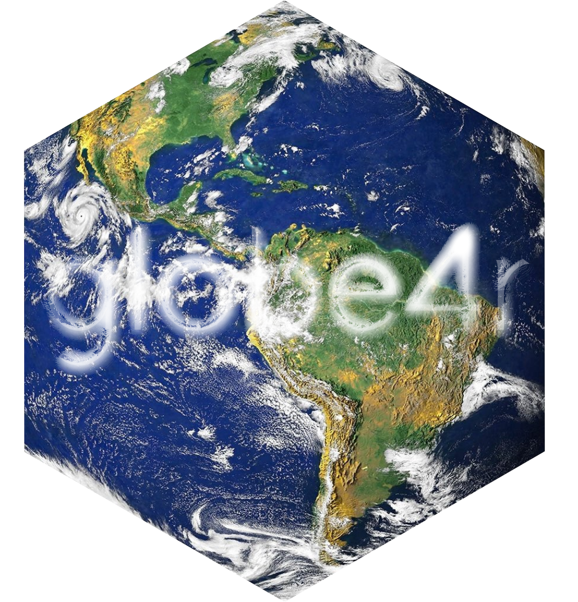

<!-- README.md is generated from README.Rmd. Please edit that file -->
<!-- badges: start -->
<!-- badges: end -->
globe4r
=======

Interactive globes for R via [globe.gl](https://github.com/vasturiano/globe.gl).



Installation
------------

You can install the globe4r from Github:

``` r
# install.packages("remotes")
remotes::install_github("JohnCoene/globe4r")
```

Example
-------

This is a basic example which shows you how to solve a common problem:

``` r
library(globe4r)

create_globe() %>% # initialise
  globe_img_url() %>% # add image background
  globe_pov( # position camera
    lat = -21, 
    lon = 179,
    ms = 0
  ) %>% 
  globe_points( # add points
    data = quakes,
    lat = lat,
    lon = long,
    color = mag
  ) %>% 
  scale_points_color()
```
